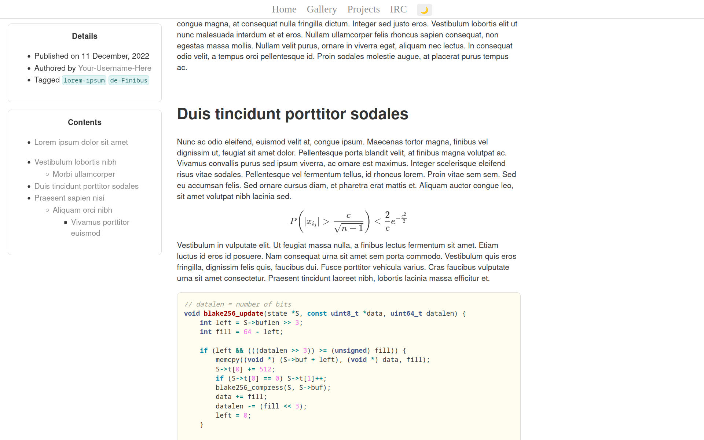
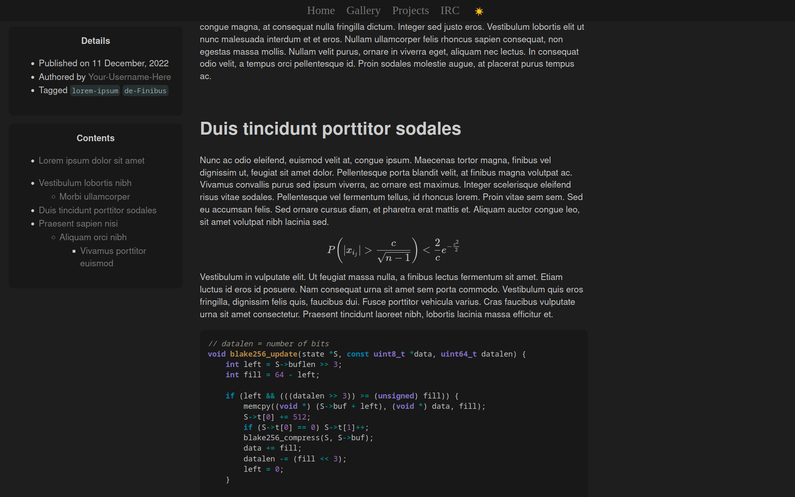

# Delicious

A blog template built with Jekyll

***Note**: I've since ported my website to Hugo and created the identical template [Succulent](https://github.com/Infinitifall/Succulent)*

## Features

- Tactile and minimalist theme
- Base page size < 64kB, with latex enabled < 256kB
- Responsive design, looks good on Desktop, Laptop, Tablet and Mobile
- Embeds on social media sites like Facebook, Twitter, Slack
- Server side rendered LaTeX that works without JavaScript


## Install

You need to install the prerequisites `ruby`, `rubygems` and `ruby-bundler`.

- For Debian Linux based distros (Debian, Mint, Ubuntu), install them via

    ```bash
    sudo apt install ruby ruby-rubygems ruby-dev ruby-bundler
    ```

- For Arch Linux based distros (Arch, Manjaro), install them via
    ```bash
    sudo pacman -S ruby rubygems ruby-bundler
    ```

- For other distributions, packages might be named slightly differently

- For Windows/macOS, [follow the guide](https://jekyllrb.com/docs/installation/)

**Note**: For Linux, prefer installing packages from your distribution's repos over installing with `gem`

Then clone this repo and install dependencies

```bash
# clone this website template and install dependencies
git clone https://github.com/Infinitifall/Delicious
cd Delicious
bundle install

# serve website locally
bundle exec jekyll serve

# or build the website
bundle exec jekyll build
```


## Screenshots




