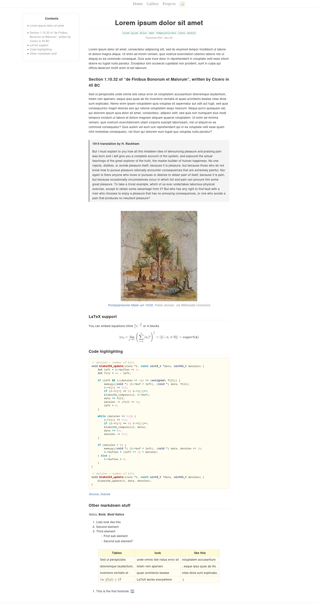

# Delicious

A blog template built with Jekyll

***Note**: I've since ported my website to Hugo and created the identical template [Succulent](https://github.com/Infinitifall/Succulent), which I recommend over Jekyll.*

## Features

- Tactile and minimalist theme
- Base page size < 64kB, with latex enabled < 256kB
- Responsive design, looks good on Desktop, Laptop, Tablet and Mobile
- Embeds on social media sites like Facebook, Twitter, Slack
- Server side rendered LaTeX that works without JavaScript


## Install

Install ruby and rubygems first. They are available in the official repositories of all the major distributions. On Arch Linux, this would be `sudo pacman -S ruby rubygems`. Install and set up bundle

```bash
gem install bundler

# add local ruby gems to your $PATH
export PATH=~/.local/share/gem/ruby/3.0.0/bin:$PATH

# tell bundle where to install local gems
bundle config set --local path ~/.gem
```

Then clone this repo and install dependencies

```bash
# clone this website template and install dependencies
git clone https://github.com/Infinitifall/Delicious
cd Delicious
bundle install

# serve website locally
bundle exec jekyll serve

# or build the website
bundle exec jekyll build
```


## Screenshots




